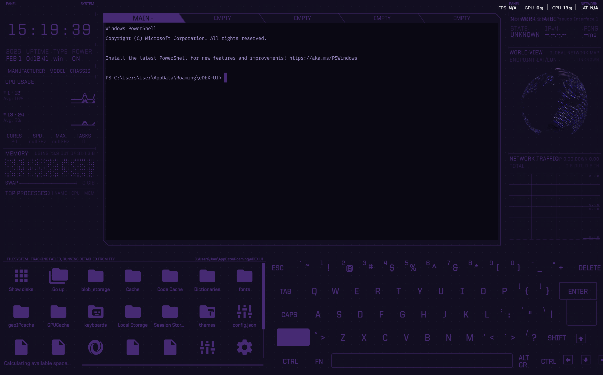
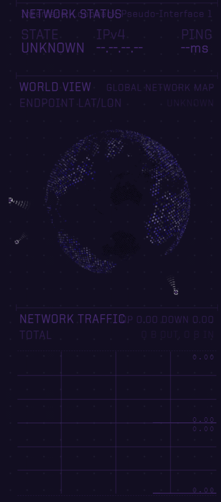
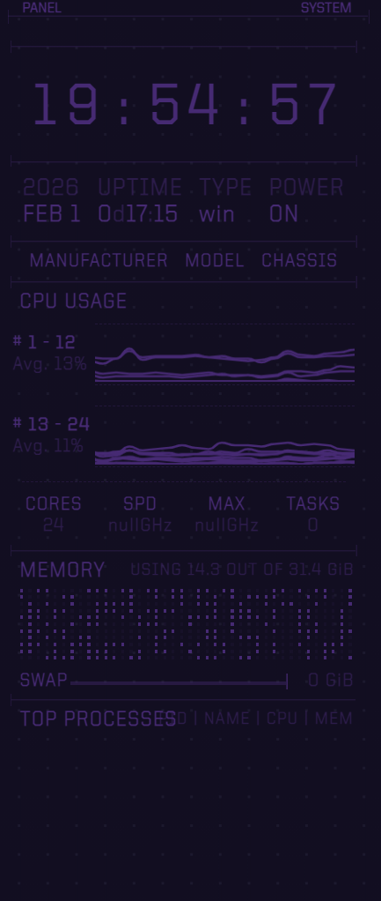
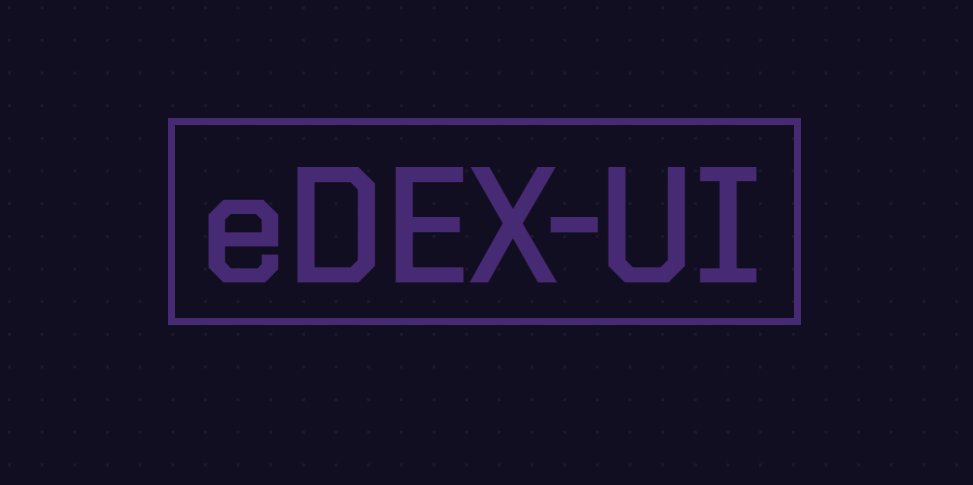

# 🌌 Russian Violet Theme for EDEX UI

**Russian Violet** is a deep, atmospheric theme for [EDEX UI](https://github.com/GitSquared/edex-ui), crafted to deliver a moody, futuristic terminal experience. Inspired by dark ultraviolet hues and low-light cyber aesthetics, this theme blends rich purples, muted violets, and soft lavender highlights against near-black backgrounds for maximum immersion and long-session comfort.

Designed for developers, hackers, and terminal enthusiasts who want their interface to feel **focused, elegant, and cinematic**.

---

## ✨ Visual Philosophy

Russian Violet emphasizes **contrast without harshness**. Instead of bright neon colors, it uses controlled saturation and subtle glow to reduce eye strain while preserving visual depth.

- Dark environments enhance focus  
- Soft lavender text maintains readability  
- Purple accents add character without distraction  

The result is a theme that feels calm, powerful, and modern.

---

## 🎨 Features

### 🎭 Color Palette
- Deep purples and Russian violet tones  
- Near-black backgrounds for eye comfort  
- Soft lavender and muted violet accents  
- Carefully balanced contrast for readability  

### 🖥 Terminal Styling
- **Font:** `Fira Mono`
- **Foreground:** Soft lavender for clear text rendering  
- **Background:** Deep black to reduce glare  
- **Cursor:** Block style with vivid accent color  
- **Selection & highlights:** Subtle purple glow  

### 🌐 UI Glow & Effects
- RGBA-based glow effects for panels and UI elements  
- Soft lighting that enhances depth without overwhelming the screen  
- Futuristic feel while staying minimal and professional  

### 🎛 ANSI Color Scheme
- Fully customized ANSI colors  
- Consistent output styling across CLI tools  
- Designed to preserve semantic meaning (errors, warnings, success states)  

### 🌍 Globe Styling
- Custom globe base color  
- Distinct marker, pin, and satellite colors  
- Glow effects for improved visibility and style  
- Seamlessly integrated with the overall color theme  

---

## 📦 Installation

1. Launch **EDEX UI**
2. Open **Settings**
3. Navigate to **Theme**
4. Click **Import Theme**
5. Select `russian-violet-theme.json`
6. Apply the theme and restart EDEX UI if needed

Your terminal should now reflect the Russian Violet aesthetic.

---

## 🛠 Customization Tips

- You can tweak brightness by adjusting `rgba` alpha values in the theme file  
- Increasing purple saturation will push the theme toward a cyberpunk look  
- Lowering glow opacity creates a more minimal, distraction-free setup  

Feel free to fork and adapt the theme to match your personal workflow.

---

## 🧠 Best Used For

- Late-night coding sessions  
- Cyberpunk or sci-fi setups  
- Psychological, horror, or atmospheric projects  
- Users who prefer dark, moody interfaces with elegance  

---

## 📸 Screenshots

---

## 📜 License

This theme is released under the **MIT License**.  
You are free to use, modify, and distribute it.

---

## 💜 Credits

Created with care for the EDEX UI community.  
If you enjoy this theme, consider sharing it or building on it.

---

**Welcome to Russian Violet.**  
*Where darkness meets clarity.*
